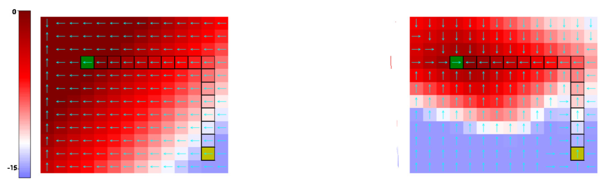
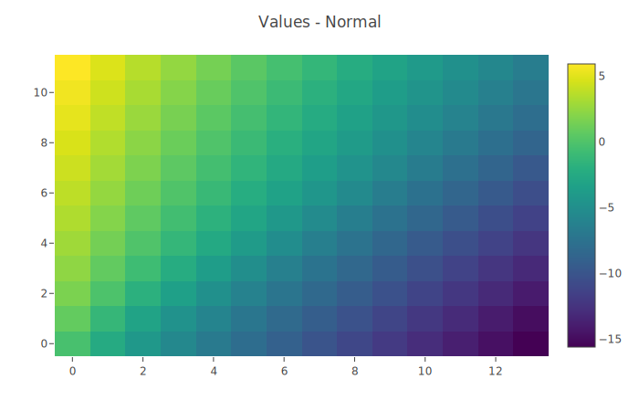
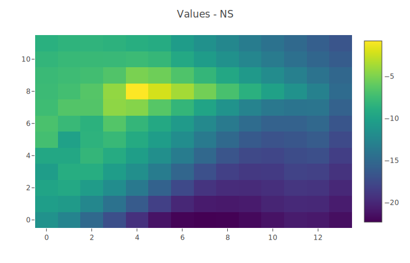

# VINS
Implementation of Value Iteration from Demonstrations with Negative Sampling (VINS) for conservative value function extrapolation in continuous state and action spaces

From the paper `Learning Self-Correctable Policies and Value Functions from Demonstrations with Negative Sampling`: https://arxiv.org/abs/1907.05634

## Usage

### Dependencies:
* PyTorch
* NumPy
* Visdom
* Termcolor

### Note about Visdom
Visdom is how everything gets plotted. To install, run `pip install visdom`. Before running the code in this repo, open a seprate terminal window
and run the command `visdom`. A GUI will appear on `localhost:8097`. This process has to run in the background for plotting to work. If it's not running,
you'll get lots of errors.

### Note about Termcolor
Install with `pip install termcolor`

### Running the Code
To run the experiment from the paper, run the command `python train.py` from the top level of this repo.

## Code Structure

### Path
Contains the implementation of the path environment from the paper

### Vins
Contains code for the learning agent (`agent.py`), neural networks (`models.py`), and visdom plotting (`visualize.py`)

## Experiments

I repeated the path-following experiment from the paper, where you attempt to extrapolate a value function using 1) the usual TD error and 2) the TD error augmented with a negative sampling error. The following two plots show the value function across the whole state space of the environment.

**Paper Results**

**TD Error (Mine)**

**TD Error + Negative Sampling (Mine)**

